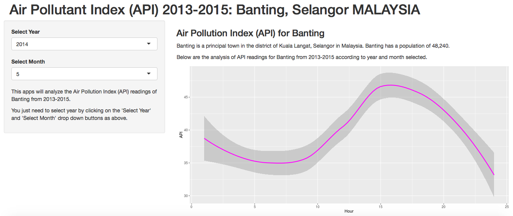

Module 9 Developing Data Products: Course Project
========================================================
author: Syahrimi Hasbullah 

date: 29 Januari 2016

autosize:true

Project Detail
========================================================

This apps will analyze the Air Pollution Index (API) readings of Banting (a district in Selangor, Malaysia) from 2013-2015 according to every months in each year. 
You just need to select year and month by clicking on the 'Select Year' and 'Select Month' drop down buttons and the program will return the result.




Shiny Apps
========================================================

The shiny apps can be viewed at https://sha7970.shinyapps.io/mod9DDP/

The code for the shiny apps can be downloaded from the github repo at https://github.com/sha7970/DDP 

Shiny Apps (cont)
========================================================

The summary of dataset as shown below.


```
   Station.No    Location             Date            Hour      
 Min.   :41   Banting:13296   2013-08-01:   24   Min.   : 1.00  
 1st Qu.:41                   2013-08-02:   24   1st Qu.: 6.75  
 Median :41                   2013-08-03:   24   Median :12.50  
 Mean   :41                   2013-08-04:   24   Mean   :12.50  
 3rd Qu.:41                   2013-08-05:   24   3rd Qu.:18.25  
 Max.   :41                   2013-08-06:   24   Max.   :24.00  
                              (Other)   :13152                  
      API         Pollutant
 Min.   :  0.00   *:10855  
 1st Qu.: 38.00   0:  567  
 Median : 49.00   a:   32  
 Mean   : 49.82   c: 1842  
 3rd Qu.: 59.00            
 Max.   :323.00            
                           
```

Code Reproducibility
========================================================

This repo contains all the code and data making up this solution. The files and folders are the following:

- README.md
- ui.R and server.R - The shiny app code
- /project - The R Markdown used to create the RStudio Presenter presentation.
